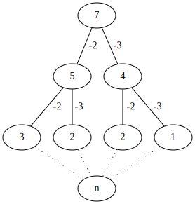

# Question 5

Let  be a set of positive integer numbers. Given an integer _K_, we want to know if there is a subset of A which the sum of it's elements is equal to _K_.

##### Recursive solution cost

The recursive solution i founded is a  giving a recursion tree similarly from Fibonnaci recursive solution.

This result comes from this recursive tree analysis:

In this tree we consider the _K_ value being 7 and the _A_ being {2, 3}, this is a good case to see and structure a solution, but not explicity explain the worst result, that result would be if we have an set with the value {1} which translates in a call going from _K_ to _K_ for each _n_ in the set, giving us the result .

##### Memoization strategy

To get a better time complexity result we can use the memoization strategy of this stored values, this strategy here consists in saving the already founded results, that way we can reuse then in other branch's of the tree, this leads us to a reduction in complexity where the tree starts to fade to only having to work for each _n_ one time _k_ times, which gives us .
